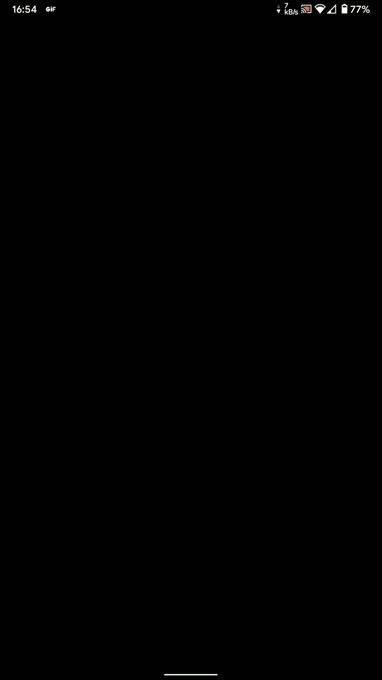

# Unique Login

## 📱Screens 
  

   </img>
  </img>
  

## 🛠 Technology 🚀

This project was developed using the following libraries and technology:

- <a href="https://flutter.dev/">Flutter 2.8</a>
- <a href="https://pub.dev/packages/http">http</a>
- <a href="https://pub.dev/packages/google_fonts">google_fonts</a>
- <a href="https://jsonplaceholder.typicode.com/">JSONPlaceholder API</a>

## 💻 About

Unique Login is an app that demonstrates a little about AnimatedContainer wave animation, which can be applied to many other apps. The authentication process does not use any backend for validation. However, it uses RegEx for email/password validation, and the only correct credentials are: email: 'teste@teste.com.br' senha: '123456789+'.
The second screen is an async call to the users from JSON Placeholder. It also works for the WEB!

---
Made with ♥ by Mariugo 🚀
